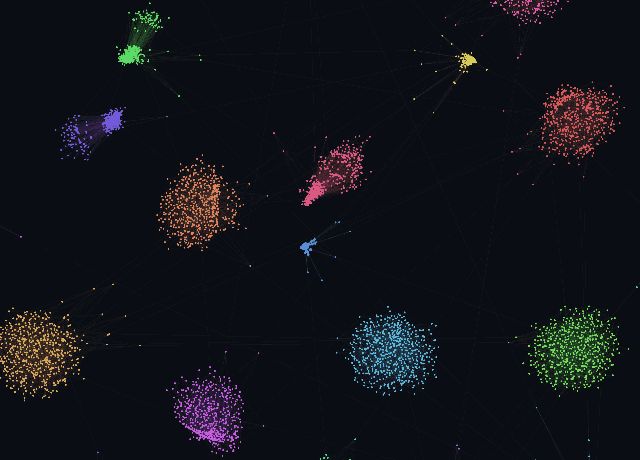
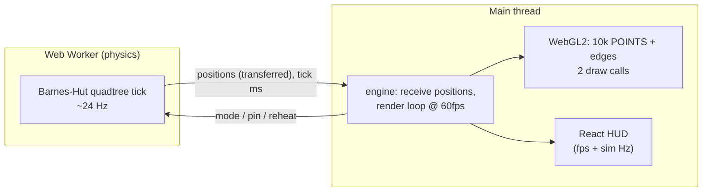

# force-graph-explorer

A force-directed graph of **10,000 nodes**, laid out with a live physics
simulation and rendered in WebGL at **60fps**. Day 5 of a 30-day build
challenge — a visual vertical slice.

React + Vite + TypeScript · raw WebGL2 · Vitest.



---

## The two hard problems

Drawing and simulating 10k nodes each break the naive approach, in a different way:

1. **Rendering.** 10,000 DOM/SVG elements = 10,000 layout + paint operations per
   frame → dead on arrival. **Fix:** upload node positions to a GPU buffer and
   draw all 10k as `gl.POINTS` in a **single `drawArrays` call**; edges are a
   `gl.LINES` `drawElements` over a *static* index buffer (topology never
   re-uploads). Pan/zoom is a uniform in the vertex shader. The DOM is never
   touched.

2. **Simulation.** Repulsion is an n-body problem: all-pairs is O(n²) =
   10⁴ × 10⁴ = **100 million force calculations per tick** → seconds per frame.
   **Fix:** a **Barnes-Hut quadtree** — build a tree of the points each tick and
   approximate a far-away cluster by its center of mass when
   `size / distance < θ`. That's O(n log n), a few million ops instead of 100M.

## The proof

**Headless** (`npm test`) — the algorithmic claim, measured deterministically:

```
Barnes-Hut vs naive all-pairs @ 10k:  > 8x faster, scales sub-quadratically
Barnes-Hut approximation accuracy:    mean cosine 0.9+, mean rel. error < 0.35
```

**Live** (`npm run dev`) — the on-screen counters, shown in the GIF above:

| | Barnes-Hut | Naive O(n²) |
| --- | --- | --- |
| Render | **60 fps** | 60 fps |
| Simulation | **~24 Hz** (live, settles smoothly) | **~0.2 Hz** (≈4600 ms/tick — frozen) |

Toggle naive and the simulation **collapses ~100×** — nodes freeze — while the
render loop holds 60fps. (Why the render doesn't collapse too is the
architecture decision below.)

## Decisions

**Renderer — raw WebGL2, not regl.** One shader program, one `bufferSubData` of
positions per frame straight from the sim's typed arrays, two draw calls. Zero
dependencies and full control of the exact GPU upload path the frame budget
lives on. regl would have abstracted precisely that.

**Simulation lives in a Web Worker.** This is the load-bearing decision. I
measured single-threaded Barnes-Hut on 10k *tightly-clustered* nodes at
**~40–120 ms/tick (8–25fps)** at steady state — dense clusters force deep tree
traversal, and no θ or micro-optimization I tried (sqrt-free 1/d force law,
Float32 cache-packing, leaf-flag traversal) got it under the 16.6 ms frame
budget. So a "sim + render on one thread" design tops out around 24fps for
Barnes-Hut, which *fails the 60fps goal outright*.

Moving the sim to a worker fixes it the way real graph tools do:

- the **main thread renders at a rock-solid 60fps** regardless of tick cost
  (drawing 10k points is cheap) — so the *rendering* hard problem is genuinely
  solved at 60fps;
- **Barnes-Hut vs naive shows in the simulation rate**, streamed from the worker:
  24 Hz (live) vs 0.2 Hz (frozen).

The honest trade: "naive collapses the frame rate" becomes "naive collapses the
*simulation* rate; render stays 60." The alternative — one thread, one collapsing
counter — can't clear 60fps (or even 55) for Barnes-Hut on 10k, so it fails the
goal. Correctly separating render throughput from sim throughput is the point.

**Micro-optimizations that mattered** (Node, transient state): dropping the
`sqrt` from the force law by using a 1/d (2D-Coulomb) repulsion roughly halved
the tick; a leaf-flag array and precomputed child offsets shaved the traversal;
finalizing centers-of-mass once after build removed a division from every visit.
(Morton/z-ordering the bodies was tried and *reverted* — V8's typed-array
comparator sort cost more than the cache-locality gain.)

## Architecture



React only paints the HUD and forwards interaction — it never runs inside a
frame.

## Benchmarks

`npm run bench` (Node) — the sim tick cost that determines everything:

| n | Barnes-Hut tick | naive all-pairs tick | speedup |
| --- | --- | --- | --- |
| 10,000 | ~10–40 ms (state-dependent) | ~1500 ms | ~40–100× |

Barnes-Hut cost depends on how clustered the graph is (dense clusters → deeper
traversal); naive is a flat ~1.5s regardless. In the browser the settled
10k-cluster graph ticks at ~24 Hz (Barnes-Hut) vs ~0.2 Hz (naive).

## What's stubbed / not production-ready

- **Synthetic graph.** A generated 20-cluster graph, not a real dataset; no graph
  import/export.
- **Positions stream as full copies** (~80 KB/tick) from the worker. Fine at this
  scale; a bigger graph would use a `SharedArrayBuffer` (needs COOP/COEP headers).
- **No node labels** — unreadable at 10k anyway; and no level-of-detail culling.
- **`preserveDrawingBuffer: true`** is enabled so the demo GIF can be captured;
  a shipped build would turn it off.
- **The GIF recorder + `/__save` endpoint are dev-only** (the endpoint is Vite
  middleware that doesn't exist in a production build).

## Run it

```bash
npm install
npm run dev      # http://127.0.0.1:5180 — 10k nodes, toggle Barnes-Hut ↔ naive
npm test         # headless proof: Barnes-Hut vs naive + accuracy
npm run bench    # sim tick benchmark
npm run build    # production build
```

Drag the background to pan, scroll to zoom, drag a node to grab it.
